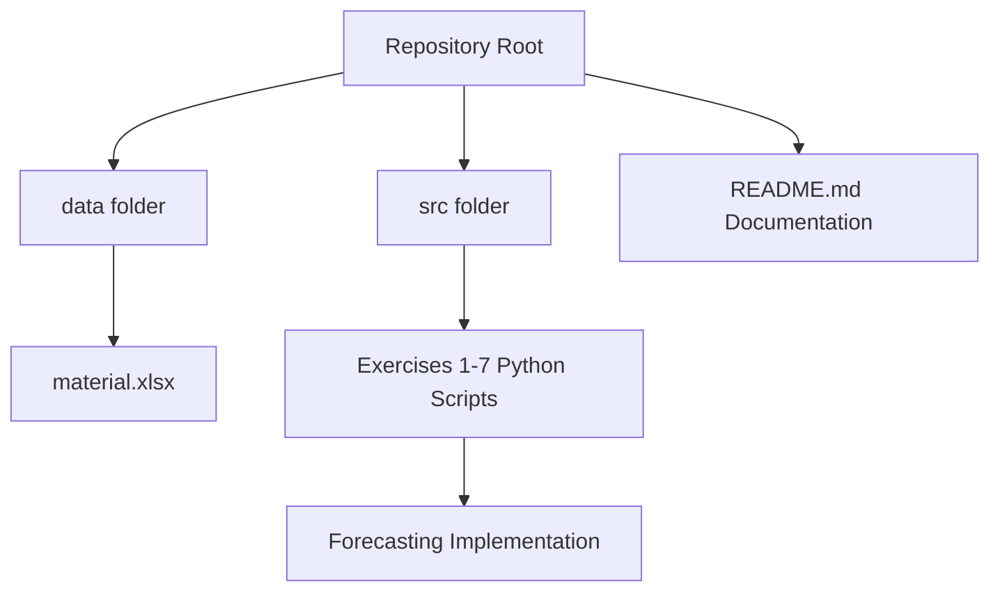
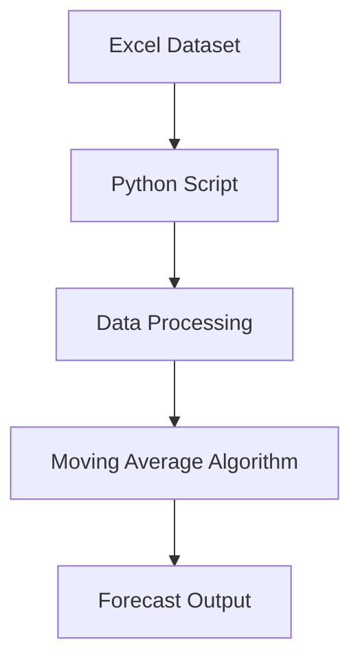

# Advanced Analytics Python Exercise  
### FH Südwestfalen — Advanced Analytics Course  


---

# Project Overview

This repository contains Python implementations of Exercises 1–7 from the **Advanced Analytics course at FH Südwestfalen**.

The exercises focus on:

- Data processing
- Demand analysis
- Statistical computation
- Forecasting techniques
- Moving Average demand forecasting

---

# Repository Structure


---

| Exercise   | Topic                | Description                   |
| ---------- | -------------------- | ----------------------------- |
| Exercise 1 | Data Loading         | Read Excel dataset            |
| Exercise 2 | Data Analysis        | Explore demand structure      |
| Exercise 3 | Statistical Metrics  | Mean, variance, std deviation |
| Exercise 4 | Demand Aggregation   | Total demand per material     |
| Exercise 5 | Period Analysis      | Time-based analysis           |
| Exercise 6 | Demand Visualization | Demand patterns               |
| Exercise 7 | Forecasting          | Moving Average Forecast       |

Moving Average Forecast   
Forecast(t+1) =
(Demand(t) + Demand(t-1) + Demand(t-2)) / 3


# Dataset Description

Dataset file:

dataset/material.xlsx

Dataset characteristics:

• 1000 materials\
• 32 time periods\
• Historical demand values\
• Structured time series data

This dataset is used to implement forecasting models.

---

# Forecast Preview

Example demand input:

| Period | Demand |
| ------ | ------ |
| 28     | 105    |
| 29     | 110    |
| 30     | 95     |
| 31     | 120    |
| 32     | 115    |

Forecast(33) =
(120 + 115 + 95) / 3

Forecast(33) = 110

| Material | Last Demand | Forecast |
| -------- | ----------- | -------- |
| MAT001   | 115         | 110      |
| MAT002   | 84          | 89       |
| MAT003   | 152         | 147      |



# Technologies Used
| Tool          | Purpose               |
| ------------- | --------------------- |
| Python 3.12   | Programming language  |
| Pandas        | Data processing       |
| NumPy         | Numerical computation |
| Excel Dataset | Input data            |
| GitHub        | Version control       |

# How to run
* Clone Repository
  ```
  git clone https://github.com/nomanmridha/Advanced-Analytics-Python-Exercise.git
  ```

* Navigate
  ```
  cd Advanced-Analytics-Python-Exercise
  ```
* Run Exercise
  ```
  python src/exercise7.py
  ```

# Script Index

  ------------------------------------------------------------------------------------------------------------------------------------------------------
  Script             Purpose                  Download
  ------------------ ------------------------ ----------------------------------------------------------------------------------------------------------
  exercise1_a.py     Basic output program     [https://raw.githubusercontent.com/nomanmridha/Advanced-Analytics-Python-Exercise/main/src/exercise1_a.py](https://github.com/nomanmridha/Advanced-Analytics-Python-Exercise/blob/main/src/Exercise%201.a.py)

  exercise1_b.py     Circle area computation  [https://raw.githubusercontent.com/nomanmridha/Advanced-Analytics-Python-Exercise/main/src/exercise1_b.py](https://github.com/nomanmridha/Advanced-Analytics-Python-Exercise/blob/main/src/Exercise%201.b.py)

  exercise2_a.py     Cube surface area        [https://raw.githubusercontent.com/nomanmridha/Advanced-Analytics-Python-Exercise/main/src/exercise2_a.py](https://github.com/nomanmridha/Advanced-Analytics-Python-Exercise/blob/main/src/Exercise%202.a.py)

  exercise2_b.py     Sphere calculations      [https://raw.githubusercontent.com/nomanmridha/Advanced-Analytics-Python-Exercise/main/src/exercise2_b.py](https://github.com/nomanmridha/Advanced-Analytics-Python-Exercise/blob/main/src/Exercise%202.b.py)

  exercise2_c.py     Employee pay computation [https://raw.githubusercontent.com/nomanmridha/Advanced-Analytics-Python-Exercise/main/src/exercise2_c.py](https://github.com/nomanmridha/Advanced-Analytics-Python-Exercise/blob/main/src/Exercise%202.c.py)

  exercise3_a.py     Population growth model  [https://raw.githubusercontent.com/nomanmridha/Advanced-Analytics-Python-Exercise/main/src/exercise3_a.py](https://github.com/nomanmridha/Advanced-Analytics-Python-Exercise/blob/main/src/Exercise%203.a.py)

  exercise3_b.py     GCD Euclidean algorithm  [https://raw.githubusercontent.com/nomanmridha/Advanced-Analytics-Python-Exercise/main/src/exercise3_b.py](https://github.com/nomanmridha/Advanced-Analytics-Python-Exercise/blob/main/src/Exercise%203.b.py)

  exercise3_c.py     Input series statistics  [https://raw.githubusercontent.com/nomanmridha/Advanced-Analytics-Python-Exercise/main/src/exercise3_c.py](https://github.com/nomanmridha/Advanced-Analytics-Python-Exercise/blob/main/src/Exercise%203.c.py)

  exercise3_d.py     Exponential function     [https://raw.githubusercontent.com/nomanmridha/Advanced-Analytics-Python-Exercise/main/src/exercise3_d.py](https://github.com/nomanmridha/Advanced-Analytics-Python-Exercise/blob/main/src/Exercise%203.d.py)

  exercise3_e.py     Factorial computation    [https://raw.githubusercontent.com/nomanmridha/Advanced-Analytics-Python-Exercise/main/src/exercise3_e.py](https://github.com/nomanmridha/Advanced-Analytics-Python-Exercise/blob/main/src/Exercise%203.e.py)

  exercise3_f.py     Minimum age detection    [https://raw.githubusercontent.com/nomanmridha/Advanced-Analytics-Python-Exercise/main/src/exercise3_f.py](https://github.com/nomanmridha/Advanced-Analytics-Python-Exercise/blob/main/src/Exercise%203.f.py)

  exercise5_a.py     List summation           [https://raw.githubusercontent.com/nomanmridha/Advanced-Analytics-Python-Exercise/main/src/exercise5_a.py](https://github.com/nomanmridha/Advanced-Analytics-Python-Exercise/blob/main/src/Exercise%205.a.py)

  exercise5_b.py     Absolute value           [https://raw.githubusercontent.com/nomanmridha/Advanced-Analytics-Python-Exercise/main/src/exercise5_b.py](https://github.com/nomanmridha/Advanced-Analytics-Python-Exercise/blob/main/src/Exercise%205.b.py)
                     transformation           

  exercise5_c.py     Even number detection    [https://raw.githubusercontent.com/nomanmridha/Advanced-Analytics-Python-Exercise/main/src/exercise5_c.py](https://github.com/nomanmridha/Advanced-Analytics-Python-Exercise/blob/main/src/Exercise%205.c.py)

  exercise5_d.py     Range summation function [https://raw.githubusercontent.com/nomanmridha/Advanced-Analytics-Python-Exercise/main/src/exercise5_d.py](https://github.com/nomanmridha/Advanced-Analytics-Python-Exercise/blob/main/src/Exercise%205.d.py)

  exercise7_a.py       Moving average           [https://raw.githubusercontent.com/nomanmridha/Advanced-Analytics-Python-Exercise/main/src/exercise7.py](https://github.com/nomanmridha/Advanced-Analytics-Python-Exercise/blob/main/src/Exercise_7_a.py)
                     forecasting              
  ------------------------------------------------------------------------------------------------------------------------------------------------------

---

# Learning Outcomes
This project demonstrates:

  - Data processing using Python
  - Statistical analysis
  - Demand analysis techniques
  - Forecasting implementation
  - Moving average model development
  - Analytical thinking and implementation

# Future Improvements
Potential enhancements:

  - Exponential smoothing
  - ARIMA forecasting
  - Forecast accuracy metrics
  - Visualization dashboard
  - Machine learning forecasting

---

## 👤 Author
**Course:** Advance Analytics (WiSe26)  
**University:** Fachhochschule Südwestfalen  
**Supervisor:** Prof. Dr. Christian Leubner  
**Project Type:** Individual Research Project


## 🤝 Connect & Contact

[](https://www.linkedin.com/in/md-abdullah-al-noman-333aa4155/)
[](https://github.com/nomanmridha/)
[](mailto:noman.hr.18@gmail.com)
* **University:** FH Südwestfalen – Advanced Analytics

---

📌 *This repository demonstrates how academic projects can be elevated to industry-ready analytics portfolios through strong documentation, business framing, and technical rigor.*
