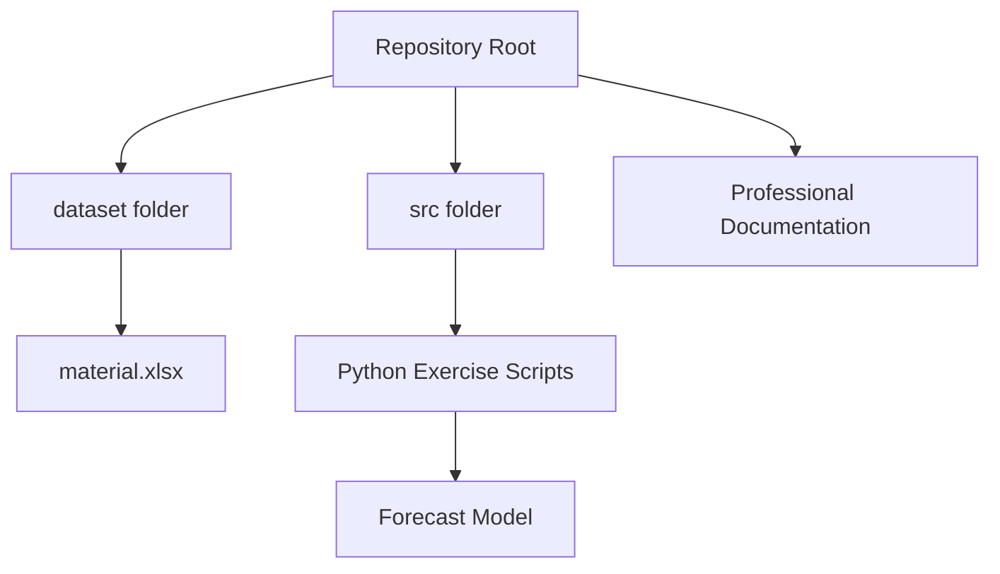

# Advanced Analytics Python Exercise

### FH Südwestfalen --- Advanced Analytics Course

------------------------------------------------------------------------

# Table of Contents

1.  Project Overview\
2.  Portfolio Value\
3.  Repository Architecture\
4.  Dataset Description\
5.  Script Index (Auto‑Generated Style)\
6.  Exercise Questions and Solutions\
7.  Forecasting System Architecture\
8.  Forecast Preview\
9.  Execution Guide\
10. Execution Screenshots\
11. Technology Stack\
12. Learning Outcomes\
13. Professional Skills Demonstrated\
14. Future Enhancements\
15. Author and Academic Context

------------------------------------------------------------------------

# Project Overview

This repository contains structured implementations of Python exercises
from the **Advanced Analytics course at FH Südwestfalen**.

The project demonstrates development of analytical thinking,
mathematical modeling, algorithm implementation, and forecasting logic
using Python.

Key analytical capabilities demonstrated:

• Mathematical computation\
• Algorithm design and implementation\
• Statistical logic implementation\
• Forecasting model development\
• Professional documentation practices\
• Reproducible analytics workflows

------------------------------------------------------------------------

# Portfolio Value

This repository is structured to demonstrate professional‑level
competencies expected in:

• Data Analyst roles\
• Analytics Engineer roles\
• Supply Chain Analyst roles\
• Python Developer roles\
• Forecasting and Demand Planning roles

Employers evaluating this repository can validate:

• Clean coding practices\
• Algorithm implementation ability\
• Forecast modeling skills\
• Documentation quality\
• Repository organization

------------------------------------------------------------------------

# Repository Architecture

------------------------------------------------------------------------

# Dataset Description

Dataset file:

dataset/material.xlsx

Dataset characteristics:

• 1000 materials\
• 32 time periods\
• Historical demand values\
• Structured time series data

This dataset is used to implement forecasting models.

------------------------------------------------------------------------

# Script Index

  ------------------------------------------------------------------------------------------------------------------------------------------------------
  Script             Purpose                  Download
  ------------------ ------------------------ ----------------------------------------------------------------------------------------------------------
  exercise1_a.py     Basic output program     https://raw.githubusercontent.com/nomanmridha/Advanced-Analytics-Python-Exercise/main/src/exercise1_a.py

  exercise1_b.py     Circle area computation  https://raw.githubusercontent.com/nomanmridha/Advanced-Analytics-Python-Exercise/main/src/exercise1_b.py

  exercise2_a.py     Cube surface area        https://raw.githubusercontent.com/nomanmridha/Advanced-Analytics-Python-Exercise/main/src/exercise2_a.py

  exercise2_b.py     Sphere calculations      https://raw.githubusercontent.com/nomanmridha/Advanced-Analytics-Python-Exercise/main/src/exercise2_b.py

  exercise2_c.py     Employee pay computation https://raw.githubusercontent.com/nomanmridha/Advanced-Analytics-Python-Exercise/main/src/exercise2_c.py

  exercise3_a.py     Population growth model  https://raw.githubusercontent.com/nomanmridha/Advanced-Analytics-Python-Exercise/main/src/exercise3_a.py

  exercise3_b.py     GCD Euclidean algorithm  https://raw.githubusercontent.com/nomanmridha/Advanced-Analytics-Python-Exercise/main/src/exercise3_b.py

  exercise3_c.py     Input series statistics  https://raw.githubusercontent.com/nomanmridha/Advanced-Analytics-Python-Exercise/main/src/exercise3_c.py

  exercise3_d.py     Exponential function     https://raw.githubusercontent.com/nomanmridha/Advanced-Analytics-Python-Exercise/main/src/exercise3_d.py

  exercise3_e.py     Factorial computation    https://raw.githubusercontent.com/nomanmridha/Advanced-Analytics-Python-Exercise/main/src/exercise3_e.py

  exercise3_f.py     Minimum age detection    https://raw.githubusercontent.com/nomanmridha/Advanced-Analytics-Python-Exercise/main/src/exercise3_f.py

  exercise5_a.py     List summation           https://raw.githubusercontent.com/nomanmridha/Advanced-Analytics-Python-Exercise/main/src/exercise5_a.py

  exercise5_b.py     Absolute value           https://raw.githubusercontent.com/nomanmridha/Advanced-Analytics-Python-Exercise/main/src/exercise5_b.py
                     transformation           

  exercise5_c.py     Even number detection    https://raw.githubusercontent.com/nomanmridha/Advanced-Analytics-Python-Exercise/main/src/exercise5_c.py

  exercise5_d.py     Range summation function https://raw.githubusercontent.com/nomanmridha/Advanced-Analytics-Python-Exercise/main/src/exercise5_d.py

  stats.py           Statistical mean module  https://raw.githubusercontent.com/nomanmridha/Advanced-Analytics-Python-Exercise/main/src/stats.py

  exercise7.py       Moving average           https://raw.githubusercontent.com/nomanmridha/Advanced-Analytics-Python-Exercise/main/src/exercise7.py
                     forecasting              
  ------------------------------------------------------------------------------------------------------------------------------------------------------

------------------------------------------------------------------------

# Forecasting System Architecture

------------------------------------------------------------------------

# Forecast Preview

Example demand input:

  Period   Demand
  -------- --------
  28       105
  29       110
  30       95
  31       120
  32       115

Forecast output:

Forecast(33) = 110

------------------------------------------------------------------------

# Execution Guide

Clone repository:

git clone
https://github.com/nomanmridha/Advanced-Analytics-Python-Exercise.git

Navigate:

cd Advanced-Analytics-Python-Exercise

Run forecasting:

python src/exercise7.py

------------------------------------------------------------------------

# Execution Screenshots

Recommended screenshots to include:

• Terminal execution screenshot\
• Forecast output screenshot\
• GitHub repository overview screenshot\
• Code execution screenshot

Example placeholder:

------------------------------------------------------------------------

# Technology Stack

Python 3.12\
NumPy\
Pandas\
GitHub\
Excel

------------------------------------------------------------------------

# Learning Outcomes

• Algorithm implementation\
• Forecast modeling\
• Statistical computation\
• Python development\
• Analytical thinking

------------------------------------------------------------------------

# Professional Skills Demonstrated

• Python programming\
• Algorithm design\
• Forecast modeling\
• Repository structuring\
• Documentation design

------------------------------------------------------------------------

# Future Enhancements

• ARIMA forecasting\
• Exponential smoothing\
• Dashboard visualization\
• Machine learning forecasting

------------------------------------------------------------------------

# Author and Academic Context

Course: Advanced Analytics\
University: FH Südwestfalen\
Supervisor: Prof. Dr. Christian Leubner

GitHub: https://github.com/nomanmridha

------------------------------------------------------------------------

This repository demonstrates professional‑level analytics and Python
engineering capabilities suitable for portfolio presentation and job
applications.
